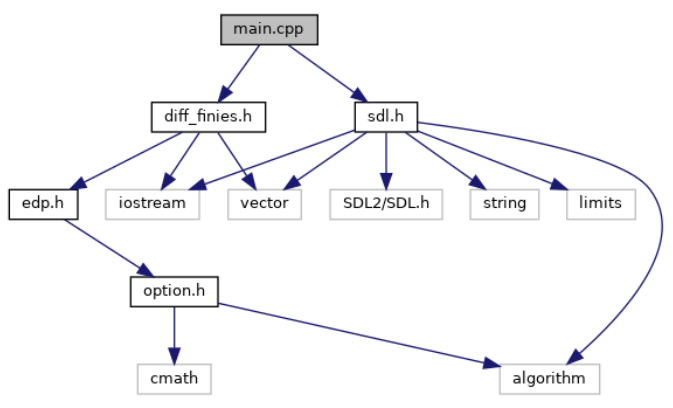
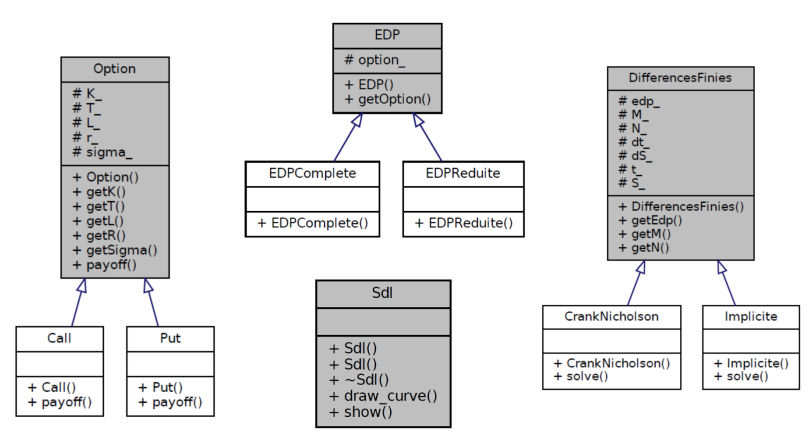

## Description

The purpose of this repository is to solve the two forms of the partial differential equation Black Scholes using the finite difference and the Crank-Nicholson methods, and to display the result obtained in a SDL window.

